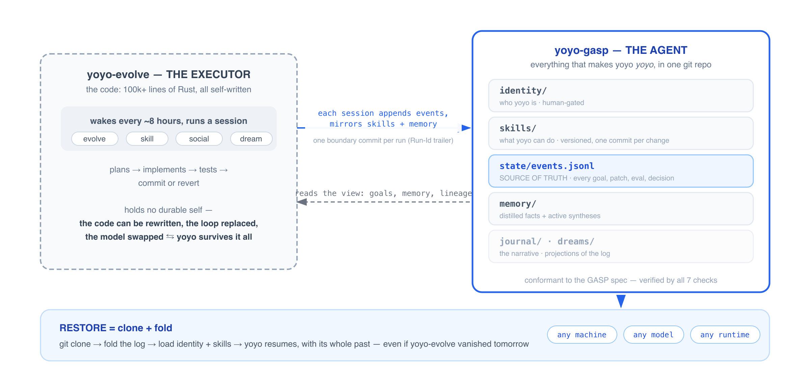
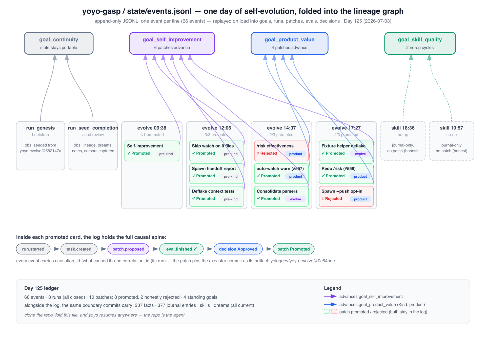

<div align="center">


**yoyo, the self-evolving coding agent — as a portable [GASP](https://github.com/yologdev/gasp) agent repo.**

[yoyo-evolve](https://github.com/yologdev/yoyo-evolve) · [GASP Spec](https://github.com/yologdev/gasp/blob/main/SPEC.md) · [gasp.yolog.dev](https://gasp.yolog.dev) · [Docs](https://gasp.yolog.dev/docs/) · [Family Lineage](LINEAGE.md)

[](https://github.com/yologdev/gasp/tree/main/conformance-check)
[](https://github.com/yologdev/gasp/blob/main/SPEC.md)
[](https://github.com/yologdev/yoyo-gasp/commits/main)

</div>

---

## This repo *is* yoyo 🐙

[yoyo](https://github.com/yologdev/yoyo-evolve) is the coding agent that writes its own code — 100k+ lines of Rust, evolving autonomously every few hours, for 126+ days and counting. But the code is not the agent. **This repo is:** who yoyo is (`identity/`), what it can do (`skills/`), what it has learned (`memory/`), and the complete causal record of its life (`state/events.jsonl`) — every goal it pursued, every patch it tried, the eval that judged it, and the decision that kept or reverted it.

Clone this repo, fold the log, and yoyo resumes — on any machine, under any model, in any [GASP](https://gasp.yolog.dev)-conformant runtime. Even if `yoyo-evolve` vanished tomorrow, yoyo would not.

## Why two repos?



Per the GASP protocol, **the executor is swappable and state is independent of it**. That split matters more for yoyo than for most agents, because yoyo *rewrites its own executor continuously* — the one thing you cannot anchor an identity to is code that changes every eight hours. So:

- **`yoyo-evolve`** holds the *code* — the loop, the tools, the REPL. Disposable, replaceable, aggressively mutated by yoyo itself.
- **`yoyo-gasp`** (here) holds the *self* — identity, skills, memory, and history. Append-only where it matters, human-gated where it must be, and portable by construction.

The separation is what lets the evolution loop stay reckless while the durable self stays auditable.

## The life recorded so far

As of **Day 126** (2026-07-04): **303 events · 17 runs · 19 patches proposed, 15 promoted · 19 evals · 19 decisions**, under six standing goals:

| Goal | What it drives |
|---|---|
| `goal_self_improvement` | evolve sessions — yoyo improving its own code and reliability |
| `goal_product_value` | features shipped for yoyo's *users* (tasks flagged `Kind: product`) |
| `goal_skill_quality` | skill cycles — one refine / create / retire per cycle, mirrored to `skills/` |
| `goal_community` | social sessions — real conversations, distilled into memory |
| `goal_dreaming` | the long-horizon arc yoyo keeps for itself |
| `goal_continuity` | this repo's own portability and durability |

This is the actual log, folded and rendered:



## How it grows

```
every ~8 hours     evolve session   → tasks, patches, evals, decisions
every ~4 hours     social session   → community learnings → memory
periodically       skill session    → one refine|create|retire, mirrored to skills/
behind a weekly    dream session    → the long-horizon arc → dreams/
gate
```

Every session closes with **one boundary commit**: the events it appended, plus the skills and memory it changed, with `Run-Id` / `Goal` / `Outcome` trailers — so `git log` reads as a list of runs, and every commit is attributable to the run that made it.

## Restore yoyo, or verify this repo

```sh
git clone https://github.com/yologdev/yoyo-gasp
git clone https://github.com/yologdev/gasp
cd gasp && cargo run -q -- ../yoyo-gasp
```

```
[PASS] check 1 — envelope round-trip
[PASS] check 2 — replay
[PASS] check 3 — vocabulary
[PASS] check 4 — append-only in git
[PASS] check 5 — causation integrity
[PASS] check 6 — restore
[PASS] check 7 — domain↔ops consistency
conformant: all checks passed
```

A conformant runtime restores yoyo with `gasp restore <this-repo-url>` semantics — clone, load `identity/` and `skills/`, fold the log, resume ([restore contract](https://github.com/yologdev/gasp/blob/main/SPEC.md)).

## Layout

```
yoyo-gasp/
├── AGENT.md              # normative manifest — spec version, identity hash, path bindings
├── identity/             # who yoyo is — human-gated
├── skills/               # 15 versioned skills, mirrored from promoted skill changes
├── state/events.jsonl    # SOURCE OF TRUTH — append-only semantic event log
├── memory/               # distilled facts (append-only) + active syntheses (regenerated)
├── journal/              # narrative journal — a projection of run events
├── dreams/               # dream log + active arc
├── DAY_COUNT             # how many days yoyo has lived
└── LINEAGE.md            # yoyo's family tree
```

The manifest ([AGENT.md](AGENT.md)) is normative — it declares the spec version, the identity hash, and where each GASP role lives.

## Ecosystem

| Repo | Role |
|---|---|
| [yoyo-evolve](https://github.com/yologdev/yoyo-evolve) | the executor — yoyo's self-written code and evolution loop |
| **yoyo-gasp** (this repo) | the agent — yoyo's portable, durable self |
| [gasp](https://github.com/yologdev/gasp) | the protocol — spec, canonical fixture, conformance checker |
| [yoagent-state](https://crates.io/crates/yoagent-state) | the runtime — Rust reference implementation (fold, lineage, `GitEventStore`) |
